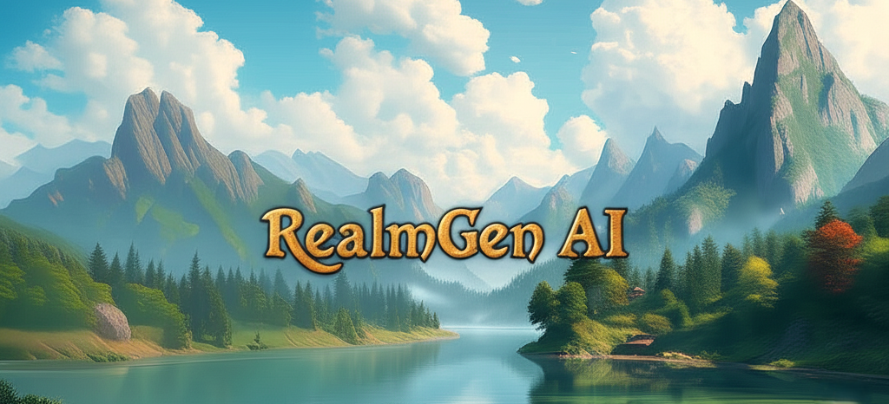

#  RealmGen AI
### *Procedural worlds, AI-powered storytelling—ready for your next adventure!*

<div align="center">



*Enjoy persistent locations in AI content*

[🚀 Quick Start](#-quick-start) • [✨ Features](#-features) • [🎮 Demo](#-demo)

[](https://www.buymeacoffee.com/liamlb)

</div>

---


RealmGen AI combines classic procedural map generation with modern LLMs to create richly described, interactive fantasy worlds. Generate vast terrains, populate them with AI-crafted descriptions, and explore through an intuitive web interface.

## ✨ Features

- **Procedural World Map Generation**  
  Generate large, detailed world maps with varied terrain (forests, mountains, rivers, castles, roads, etc.) using noise, erosion, and classification algorithms.

- **Interactive Web Map Editor**  
  Visualize and edit the world map in your browser (`templates/index.html`), click on nodes to view or update descriptions, and control LLM crawlers.

- **LLM-Powered Descriptions**  
  Automatically generate immersive, context-aware descriptions for each map node using Gemini or OpenAI LLMs. Descriptions are grounded in local and neighboring terrain.

- **Crawler System**  
  Multi-threaded LLM crawler automatically populates map nodes with LLM-generated text, respecting already-completed nodes and supporting manual or batch operation. Editable prompt.

- **Building Generator**  
  Export a building type from world map, edit the interior layout, and export back into the world map. (`building_project/templates/buildgen.html`).

- **Import/Export & JSON Interoperability**  
  Save and load maps and buildings as JSON, with robust import/export tools and compatibility for further editing or integration.

## 🌟 Why?

- **Bridges Procedural Generation and AI Storytelling**  
  RPGmap uniquely combines classic procedural map generation with modern LLMs to create not just maps, but living, richly described worlds.

- **Collaborative & Extensible**  
  The world map is a simple JSON file that is exportable and importable into other projects (like Moodweaver as a map for the LLM chat interface).

- **Automates Tedious Worldbuilding**  
  The crawler and LLM integration automate the creation of hundreds or thousands of unique, context-sensitive location descriptions—saving hours of manual work.

- **Blended Natural Terrain Descriptions**  
  Each area description integrates context from its surrounding areas, which means characters (including AI characters) can navigate (North, South, East, West, etc.) to find unique landmarks like roads, mountains, rivers, towers, etc.

- **Open, Hackable, and Modular**  
  All logic is in Python and JavaScript, with clear separation between world, building, and description generation. Easily extend or adapt for your own RPG or game engine.

## 🚀 Quick Start

1. **Install dependencies:**  
   ```bash
   pip install -r requirements.txt
   ```

2. **Set up API keys:**  
   Create a `.env` file with your LLM API keys (no quotes):
   ```env
   GOOGLE_API_KEY=your_gemini_key
   OPENAI_API_KEY=your_openai_key
   ```

3. **Generate a map:**  
   ```bash
   python map_generator.py
   ```

4. **Run the web app:**  
   ```bash
   python app.py
   ```
   Then open [http://localhost:5001](http://localhost:5001) in your browser.

5. **Explore and edit:**  
   - Click nodes to view/edit descriptions
   - Start the crawler to auto-populate the map with LLM-generated text
   - Use the building generator for castles and interiors
  
  
## 🎮 Demo

### Description:
Road
A well-worn dirt road cuts through the landscape, bordered by wildflowers and grass. Sunlight filters through the canopy above, casting shifting shadows on the path below.
To *the north and south,* the road connects with the undulating woodland, where tall trees house fluttering birds and the air carries scents of damp bark and moss. A peculiar white mushroom glistens with moisture among the undergrowth, while patches of loose stones add texture to the forest floor.
In the background, beyond the trees, *faint hints of deep waters can be detected—waves murmuring softly against a distant sandy beach.*
[Available exits: N, W, S, SE


## 📂 Project Structure

```
rpgmap/
├── map_generator.py      # World map generation, visualization, import/export
├── app.py               # Flask web server, LLM crawler, API endpoints, and web UI
├── templates/
│   └── index.html       # Main web interface for map editing and crawling
├── building_project/    # Building generator backend, web UI, and utilities
│   └── templates/
│       └── buildgen.html
├── world_map.json       # The generated world map data
└── requirements.txt
```

## 📄 License

MIT License. See [LICENSE](LICENSE) for details.

---

*Ready to build your next fantasy world? Clone, generate, and explore!*
